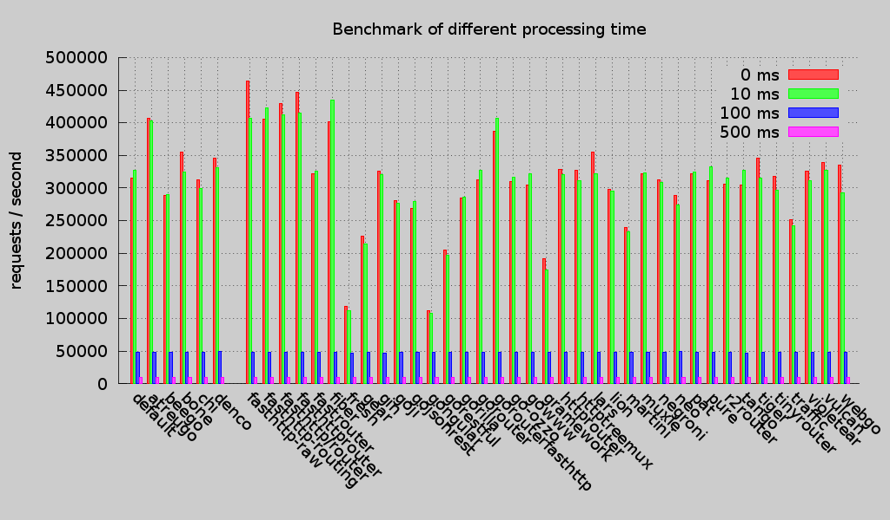
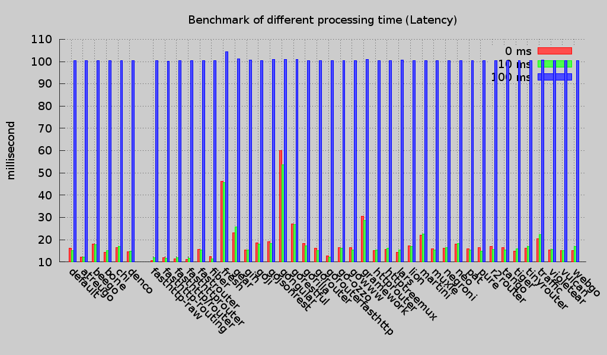
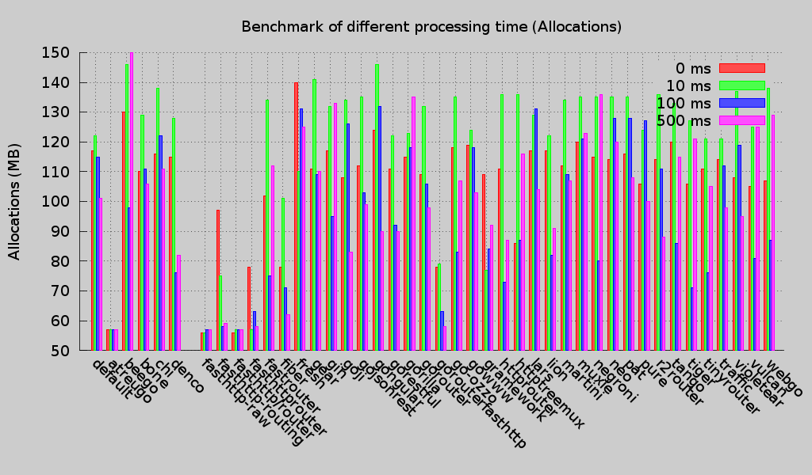
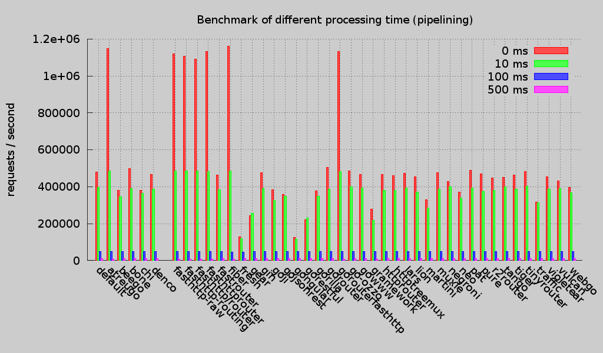
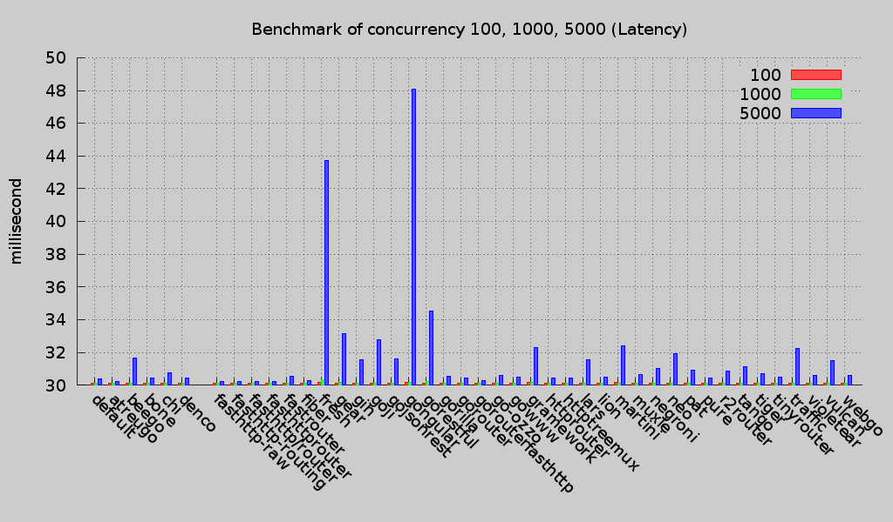
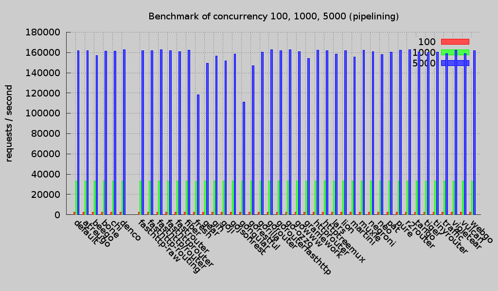

# go-web-framework-benchmark
This benchmark suite aims to compare the performance of Go web frameworks. It is inspired by [Go HTTP Router Benchmark](https://github.com/julienschmidt/go-http-routing-benchmark) but this benchmark suite is different with that. Go HTTP Router Benchmark suit aims to compare the performance of **routers** but this Benchmark suit aims to compare whole HTTP request processing.

**Last Test Updated:** 2016-09-14

*test environment*

* CPU:      Intel(R) Xeon(R) CPU E5-2620 0 @ 2.00GHz, 24 cores
* Memory:   16G
* Go:       1.7
* OS:       CentOS 6.4 / 2.6.32-358.el6.x86_64

(doesn't contain test results of neo because one error)

## Tested web frameworks

* [default http](https://golang.org/pkg/net/http/)
* [macaron](https://github.com/Unknwon/macaron)
* [go-json-rest](https://github.com/ant0ine/go-json-rest)
* [beego](https://github.com/astaxie/beego)
* [pat](https://github.com/bmizerany/pat)
* [fasthttprouter](https://github.com/buaazp/fasthttprouter)
* [lion](https://github.com/celrenheit/lion)
* [golf](https://github.com/dinever/golf)
* [chi](https://github.com/pressly/chi)
* [httptreemux](https://github.com/dimfeld/httptreemux)
* [baa](https://github.com/go-baa/baa)
* [go-ozzo](https://github.com/go-ozzo/ozzo-routing)
* [go-restful](https://github.com/emicklei/go-restful)
* [gin](https://github.com/gin-gonic/gin)
* [gas](https://github.com/go-gas/gas)
* [martini](https://github.com/go-martini/martini)
* [lars](https://github.com/go-playground/lars)
* [bone](https://github.com/go-zoo/bone)
* [gocraft](https://github.com/gocraft/web)
* [gorilla](https://github.com/gorilla/mux)
* [~~GuavaStudio/web~~](github.com/GuavaStudio/web)
* [clevergo](https://github.com/headwindfly/clevergo)
* [neo](ithub.com/ivpusic/neo)
* [httprouter](https://github.com/julienschmidt/httprouter)
* [iris](https://github.com/kataras/iris)
* [tango](https://github.com/lunny/tango)
* [vulcan](https://github.com/mailgun/route)
* [~~possum~~](https://github.com/mikespook/possum)
* [gongular](https://github.com/mustafaakin/gongular)
* [denco](https://github.com/naoina/denco)
* [traffic](https://github.com/pilu/traffic)
* [ace](https://github.com/plimble/ace)
* [fasthttp-routing](https://github.com/qiangxue/fasthttp-routing)
* [go-tigertonic](https://github.com/rcrowley/go-tigertonic)
* [fasthttp](https://github.com/valyala/fasthttp)
* [r2router](https://github.com/vanng822/r2router)
* [goji](https://github.com/zenazn/goji/web)
* [gojiv2](http://goji.io)
* [echo](http://gopkg.in/labstack/echo.v1)


The below web frameworks will be removed from this test because of their poor performance:
* [GuavaStudio/web](github.com/GuavaStudio/web)
* [possum](https://github.com/mikespook/possum)

version of all web frameworks is at: [libs.version](libs.version)


## Motivation
When I investigated performance of Go web frameworks, I found [Go HTTP Router Benchmark](https://github.com/julienschmidt/go-http-routing-benchmark), created by Julien Schmidt. He also developed a high performance http router: [httprouter](https://github.com/julienschmidt/httprouter). I had thought I got the performance result until I created a piece of codes to mock the real business logics:

```go
api.Get("/rest/hello", func(c *XXXXX.Context) {
		sleepTime := strconv.Atoi(os.Args[1]) //10ms
		if sleepTime > 0 {
			time.Sleep(time.Duration(sleepTime) * time.Millisecond)
		}

		c.Text("Hello world")
	})
```

When I use the above codes to test those web frameworks, the token time of route selection is not so important in the whole http request processing, although performance of route selection of web frameworks are very different.

So I create this project to compare performance of web frameworks including connection, route selection, handler processing. It mocks business logics and can set a special processing time.

The you can get some interesting results if you use it to test.

## Implementation 
When you test a web framework, this test suit will starts a simple http server implemented by this web framework. It is a real http server and only contains GET url: "/hello".

When this server processes this url, it will sleep n milliseconds in this handler. It mocks the business logics such as:
* read data from sockets
* write data to disk
* access databases
* access cache servers
* invoke other microservices
* ……

It contains a test.sh that can do those tests automatically.

It uses `wrk` to test.

## Basic Test 
The first test case is to mock 0 ms, 10 ms, 100 ms, 500 ms processing time in handlers.


the concurrency clients are 5000.


Latency is the time of real processing time by web servers. The smaller is the better.


Allocs is the heap allocations by web servers when test is running. The unit is MB. The smaller is the better.


If we enable http pipelining, test result as below:



## Concurrency Test 
In 30 ms processing time, the tets result for 100, 1000, 5000 clients is:





If we enable http pipelining, test result as below:




## Usage
You should install this package first if you want to run this test.

```
go get github.com/smallnest/go-web-framework-benchmark
```

It takes a while to install a large number of dependencies that need to be downloaded. Once that command completes, you can run:

```
cd $GOPATH/src/github.com/smallnest/go-web-framework-benchmark
go build -o  gowebbenchmark server.go
./test.sh
```

It will  generate test results in processtime.csv and concurrency.csv. You can modify test.sh to execute your customized test cases.


* If you also want to generate latency data and allocation data, you can run the script:
```
./test-latency.sh
```

* If you don't want use keepalive, you can run:
```
./test-latency-nonkeepalive.sh
```

* If you want to test http pipelining, you can run:
```
./test-pipelining.sh
```

* If you want to test some of web frameworks, you can modify the test script and only keep your selected web frameworks:
```
……
web_frameworks=( "default" "ace" "beego" "bone" "denco" "echov1" "echov2standard" "echov2fasthttp" "fasthttp-raw" "fasthttprouter" "fasthttp-routing" "gin" "gocraftWeb" "goji" "gojiv2" "gojsonrest" "gorestful" "gorilla" "httprouter" "httptreemux" "iris" "lars" "lion" "macaron" "martini" "pat" "possum" "r2router" "tango" "tiger" "traffic" "vulcan" )
……
```

## Plot
you can run the shell script `plot.sh` in testresults directory and it can generate all images in its parent directory.

### Docker
[](https://microbadger.com/images/smallnest/go-web-framework-benchmark)


I have created a docker [smallnest/go-web-framework-benchmark](https://hub.docker.com/r/smallnest/go-web-framework-benchmark/) and you can exetcute this benchmark test with this docker image as below (it mounts /opt/data at host into /data at container):
```go
docker run  -v /opt/data:/data smallnest/go-web-framework-benchmark
```

### Add new web framework
Welcome to add new Go web frameworks. You can follow the below steps and send me a pull request.

1. add your web framework link in README
2. add a hello implementation in server.go 
3. add your webframework in libs.sh 

Please add your web framework alphabetically.
